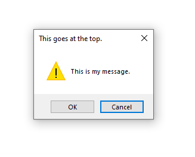

# WinAlerts

A module for alert boxes on Windows.


## Installation
```
pip install git+https://github.com/mdinunzio/winalerts.git
```

## Demo

```
import winalerts
winalerts.message_box(
    message="This is my message.",
    title="This goes at the top.",
    box_type="ok_cancel",
    icon_type="warning",
    default_button=2)
```

